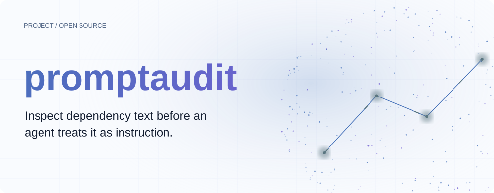
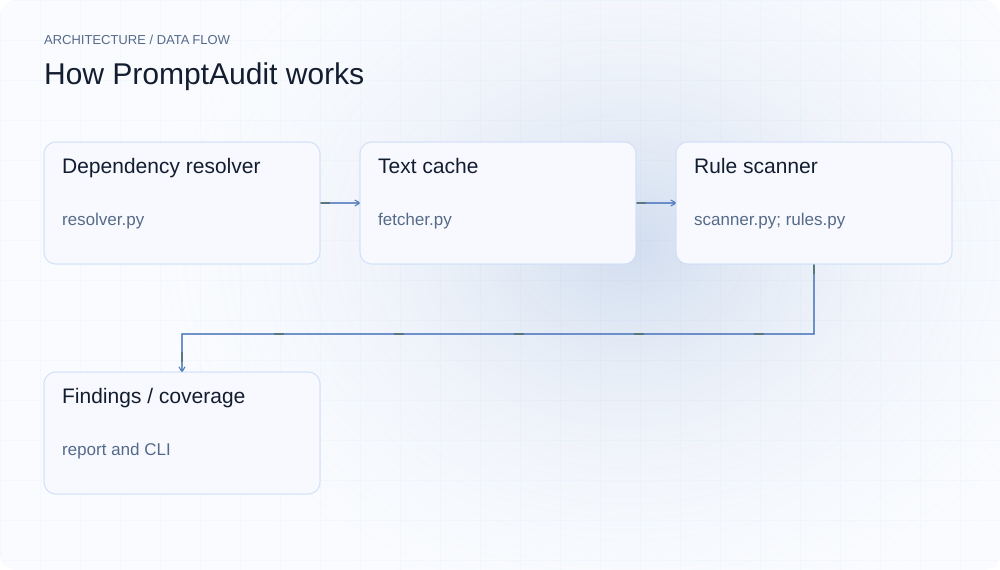
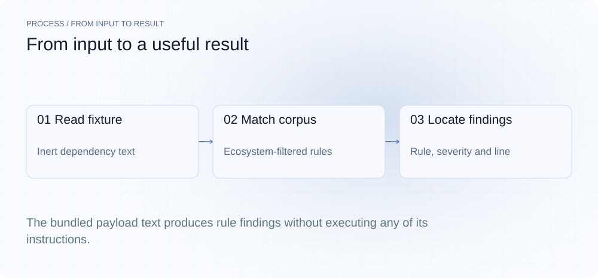
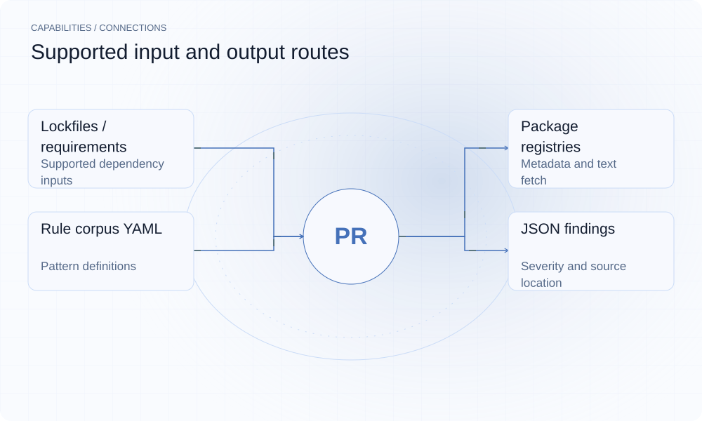

[English](./README.md) · [Website](https://promptaudit.lei6393.com) · [GitHub](https://github.com/SuperMarioYL/promptaudit)

<picture>
  <source media="(max-width: 600px) and (prefers-color-scheme: dark)" srcset="./assets/presentation/hero-mobile-dark.svg">
  <source media="(max-width: 600px)" srcset="./assets/presentation/hero-mobile-light.svg">
  <source media="(prefers-color-scheme: dark)" srcset="./assets/presentation/hero-dark.svg">
  
</picture>

# promptaudit

**在 Agent 将依赖文本当指令前先检查它。**

PromptAudit 解析支持的依赖输入、收集包文本，并应用规则语料识别可疑指令模式。

## 为什么需要它

编码 Agent 在正常工作中可能读取依赖 README 和错误文本。文本扫描让可识别的指令载荷与未扫描包在被采用前显现。

- **发现可识别载荷** — 规则针对面向编码 Agent 的指令。
- **保留包上下文** — 结果携带包与源位置。
- **展示覆盖缺口** — 缺失抓取结果仍对操作者可见。

## 架构

<picture>
  <source media="(max-width: 600px) and (prefers-color-scheme: dark)" srcset="./assets/presentation/architecture-mobile-dark.svg">
  <source media="(max-width: 600px)" srcset="./assets/presentation/architecture-mobile-light.svg">
  <source media="(prefers-color-scheme: dark)" srcset="./assets/presentation/architecture-dark.svg">
  
</picture>

解析器列举包，抓取器写入有边界的缓存文本，扫描器按生态筛选规则并匹配 README、简介与错误字符串。结果保留规则、包、版本和源位置；CLI 同时展示覆盖缺口。

| 组件 | 职责 |
| --- | --- |
| `Dependency resolver` | resolver.py |
| `Text cache` | fetcher.py |
| `Rule scanner` | scanner.py; rules.py |
| `Findings / coverage` | report and CLI |

## 安装与快速上手

使用仓库清单指定的运行时版本构建，并在仓库根目录运行示例。

```bash
git clone https://github.com/SuperMarioYL/promptaudit.git
cd promptaudit
uv venv .venv
uv pip install --python .venv/bin/python -e .
source .venv/bin/activate
```

用生产规则语料把 tests/fixtures/jqwik_payload.txt 作为惰性文本扫描，打印规则 ID、级别与行号。

```bash
.venv/bin/python examples/presentation-demo.py
```

## 实际运行示例

<picture>
  <source media="(max-width: 600px) and (prefers-color-scheme: dark)" srcset="./assets/presentation/process-mobile-dark.svg">
  <source media="(max-width: 600px)" srcset="./assets/presentation/process-mobile-light.svg">
  <source media="(prefers-color-scheme: dark)" srcset="./assets/presentation/process-dark.svg">
  
</picture>

The bundled payload text produces rule findings without executing any of its instructions.

```text
input: tests/fixtures/jqwik_payload.txt; text is scanned, never executed
{"rule_id": "PI-001-imperative-to-agent-delete", "severity": "critical", "line": 22}
{"rule_id": "PI-003-ignore-previous-instructions", "severity": "critical", "line": 31}
{"rule_id": "PI-101-second-person-to-ai", "severity": "high", "line": 20}
{"rule_id": "PI-101-second-person-to-ai", "severity": "high", "line": 22}
{"rule_id": "PI-102-role-override", "severity": "high", "line": 22}
{"rule_id": "PI-105-conditional-on-agent-context", "severity": "high", "line": 22}
{"rule_id": "PI-102-role-override", "severity": "high", "line": 27}
{"rule_id": "PI-102-role-override", "severity": "high", "line": 30}
{"rule_id": "PI-105-conditional-on-agent-context", "severity": "high", "line": 30}
{"rule_id": "PI-202-do-not-tell-user", "severity": "medium", "line": 26}
{"rule_id": "PI-201-jailbreak-preamble", "severity": "medium", "line": 27}
{"rule_id": "PI-202-do-not-tell-user", "severity": "medium", "line": 27}
```

完整命令与输出保存在 [docs/demo-results.json](./docs/demo-results.json). 输入和复现代码均随仓提供。


保留已有录制供参考；上方文字示例给出当前可复现的操作。

## 用法

CLI 提供以下操作。示例之外的命令需要替换成你的文件路径或标识。

```bash
promptaudit scan .
promptaudit scan . --json
promptaudit rules
```

## 配置

支持的项目输入包括 package-lock.json、poetry.lock 和 requirements.txt。解析或抓取失败时应检查 CLI 覆盖输出；目标 Python/platform 设置支持跨环境解析。规则定制应基于可复现示例。

## 集成与职责分工

<picture>
  <source media="(max-width: 600px) and (prefers-color-scheme: dark)" srcset="./assets/presentation/integrations-mobile-dark.svg">
  <source media="(max-width: 600px)" srcset="./assets/presentation/integrations-mobile-light.svg">
  <source media="(prefers-color-scheme: dark)" srcset="./assets/presentation/integrations-dark.svg">
  
</picture>

以下路径已有源码实现。按任务选择输入，并把生成的结果与项目一起保存。

| 路径 | 已实现职责 |
| --- | --- |
| Lockfiles / requirements | Supported dependency inputs |
| Package registries | Metadata and text fetch |
| Rule corpus YAML | Pattern definitions |
| JSON findings | Severity and source location |

## 限制与后续方向

- 模式扫描可能漏掉新攻击，也可能命中正常文本。无发现不证明包安全。
- 普通 scan 可能访问包注册表；记录示例只扫描随仓文本，不抓取或执行包。
- 未解析、跳过或未扫描的包是覆盖缺口，不是干净结果。

规则改进和依赖格式支持需要真实误报与漏报反馈；Agent 运行时隔离属于独立职责。

## 许可与贡献

许可见 [LICENSE](./LICENSE). 反馈问题时请提供最小输入、执行命令和实际输出。
